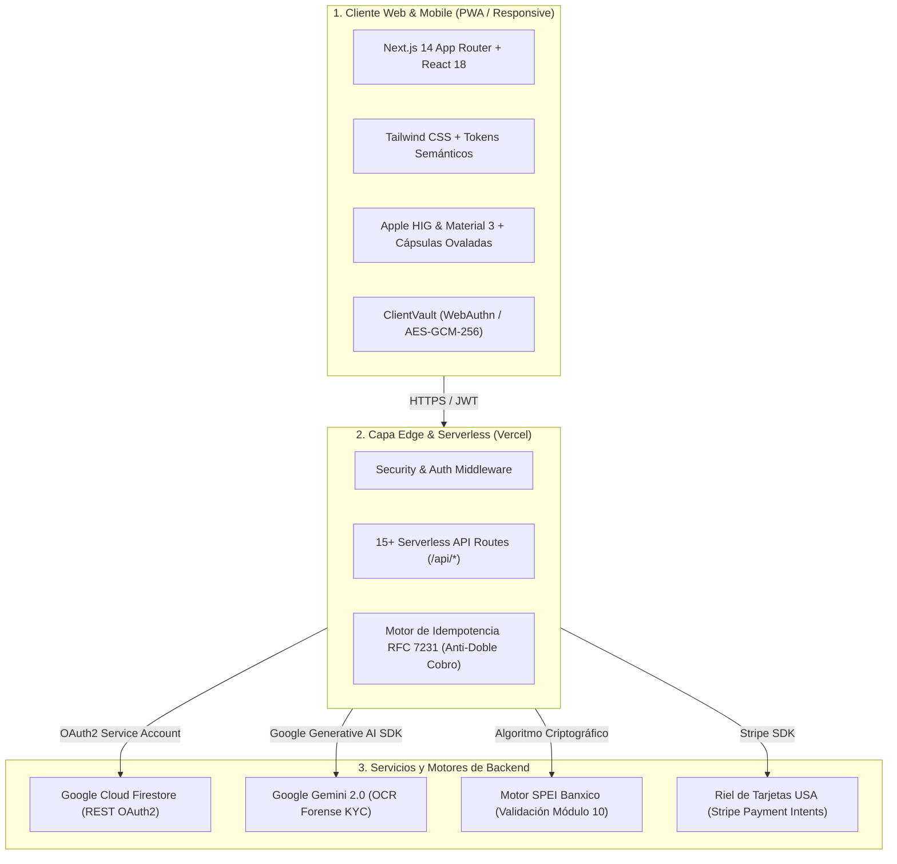

# 🏛️ KIN Fintech Platform — Visión General del Sistema (01_SYSTEM_OVERVIEW)

> **Documento Maestro:** 01_SYSTEM_OVERVIEW.md  
> **Versión de la Plataforma:** 2.5.0 Production  
> **Última Actualización:** 10 de Octubre, 2026  
> **Clasificación:** Confidencial / Arquitectura Técnica  

---

## 1. 🎯 Misión y Propuesta de Valor

**KIN** (`kin-app-pro`) es una plataforma fintech transfronteriza diseñada específicamente para la **diáspora mexicana y latina en los Estados Unidos** y sus familias en México.

A diferencia de las remesadoras tradicionales (Western Union, MoneyGram) y bancos convencionales que imponen cobros ocultos de hasta 7-10% mediante tipos de cambio manipulados, KIN opera sobre cuatro pilares de transparencia radical:

1. **Remesas Transfronterizas Directas a SPEI Banxico:**
   - Dispersión bancaria a cualquiera de las más de 50 instituciones financieras de México en menos de 60 segundos.
   - Cero sobreprecio (*No Markup*) sobre el tipo de cambio oficial interbancario USD/MXN.
   - Fórmulas de comisión transparentes y fijas.

2. **Pago Directo de Servicios Esenciales (Mexican Bill Pay):**
   - Pago directo desde el saldo en dólares de recibos de luz (CFE), telefonía (Telmex, Izzi, Totalplay), televisión (Dish) y recargas de tiempo aire.
   - Escáner por cámara con detección óptica de códigos de barras para evitar errores de captura manual.

3. **Transferencias Inmediatas P2P (KIN Cash):**
   - Billetera digital en dólares (*USD Transit Balance*) con transferencias instantáneas e interactivas entre miembros de la comunidad KIN sin comisión alguna.
   - Sincronización nativa con contactos de WhatsApp para transferencias en un toque.

4. **Bóveda de Seguridad con Cero Conocimiento (ClientVault):**
   - Almacenamiento seguro de credenciales bancarias y datos sensibles con cifrado AES-GCM-256 en el dispositivo del usuario.
   - Desbloqueo biométrico nativo (Face ID / Touch ID / WebAuthn).

---

## 2. 🏗️ Arquitectura Técnica de Alto Nivel

KIN utiliza una arquitectura moderna desacoplada en tres capas principales:



---

## 3. 💻 Ficha Técnica del Stack Tecnológico

| Componente | Tecnología | Versión | Propósito en KIN |
| :--- | :--- | :--- | :--- |
| **Framework Web** | [Next.js](https://nextjs.org/) | `14.2.35` (App Router) | Renderizado híbrido SSR/SSG, optimización de bundles y routing serverless. |
| **Lenguaje Base** | [TypeScript](https://www.typescriptlang.org/) | `^5.0.0` | Tipado estricto en modelos de dominio, validaciones bancarias y contratos de API. |
| **Diseño y Estilos** | [Tailwind CSS](https://tailwindcss.com/) | `^3.4.1` | Tokens de Modo Claro/Oscuro, ergonomía táctil móvil y sistema de diseño. |
| **Iconografía** | Google Material Symbols & Lucide | `^0.3` | Semántica visual reconocible para usuarios de cualquier nivel técnico. |
| **Base de Datos Cloud** | Google Cloud Firestore | `v1 REST API` | Base de datos NoSQL documental de alta disponibilidad con persistencia ACID por documento. |
| **Inteligencia Artificial** | Google Gemini Generative AI | `Gemini 1.5/2.0` | Extracción de datos en tiempo real y peritaje forense de INE y Pasaportes. |
| **Rieles Financieros** | Banxico SPEI + Stripe API | Standard Banxico | Validación CLABE Módulo 10 ponderado y pasarela de cobro en tarjetas de EE.UU. |
| **Hosting y DevOps** | [Vercel](https://vercel.com/) | Edge Network | Despliegue continuo (CI/CD) global, HTTPS automático y logs de auditoría. |

---

## 4. 📂 Estructura de Directorios del Código Fuente

```
kin-app/
├── docs/                           # 📚 Suite de Documentación Oficial de KIN
│   ├── 01_SYSTEM_OVERVIEW.md       # Visión general y arquitectura (Este documento)
│   ├── 02_FINTECH_LOGIC_AND_SPEI.md# Lógica bancaria SPEI, algoritmo CLABE, comisiones y FX
│   ├── 03_AML_KYC_COMPLIANCE.md    # Normativas AML/PLD, Tiers 1-3 y Gemini OCR
│   ├── 04_API_REFERENCE.md         # Catálogo completo de endpoints y contratos JSON
│   ├── 05_DESIGN_SYSTEM.md         # Sistema de diseño, cápsulas ovaladas y Modo Claro
│   └── 06_DEVOPS_AND_DEPLOYMENT.md # Variables de entorno, despliegue y contingencias
├── src/
│   ├── app/                        # Next.js 14 App Router
│   │   ├── api/                    # 15 Rutas Serverless de API
│   │   │   ├── account/            # Datos del perfil de usuario y balances
│   │   │   ├── admin/              # Migraciones y sincronización de transferencias
│   │   │   ├── auth/               # Registro, Login y OAuth Google
│   │   │   ├── bills/              # Motor de pago de servicios mexicanos
│   │   │   ├── contacts/           # Gestión de contactos frecuentes
│   │   │   ├── fx/                 # Consulta y control de cotización FX USD/MXN
│   │   │   ├── kin-cash/           # Transferencias P2P KIN Cash
│   │   │   ├── kyc/                # Verificación de identidad asistida por IA
│   │   │   ├── payment-methods/    # Tarjetas y cuentas vinculadas
│   │   │   ├── spei/               # Envío de remesas directas a Banxico
│   │   │   └── stripe/             # Generación de Payment Intents para onramp
│   │   ├── globals.css             # Estilos globales y blindaje de inputs Modo Claro
│   │   ├── layout.tsx              # Shell principal con meta-viewport móvil y fuentes
│   │   └── page.tsx                # Orquestador del Dashboard principal
│   ├── components/                 # Componentes de UI modulares
│   │   ├── views/                  # Vistas del Dashboard (Home, Send, SendQuick, Bills, etc.)
│   │   ├── modals/                 # Diálogos de acción (Kin Cash, Bill Pay, Scanner, Vault)
│   │   └── layout/                 # Navegación superior y barra inferior de pestañas (Dock)
│   ├── domain/                     # 🧠 Lógica Pura del Dominio Financiero
│   │   └── spei/
│   │       └── clabeValidator.ts   # Algoritmo Banxico Módulo 10 y catálogo bancario oficial
│   └── lib/                        # Librerías y adaptadores de infraestructura
│       ├── native/                 # Puentes con APIs nativas (Contactos Web API)
│       ├── server/                 # Conector Firestore REST, Idempotencia, Stripe
│       └── validation/             # Esquemas de validación Zod y sanitizadores
└── public/                         # Recursos estáticos, manifiesto PWA y logos
```

---

## 5. 👥 Roles de Usuario y Permisos

KIN implementa un modelo de Control de Acceso Basado en Roles (**RBAC - Role Based Access Control**):

1. **`USER` (Cliente Final):**
   - Acceso a su propia billetera, límites transaccionales según su Tier KYC actual.
   - Capacidad de enviar fondos vía SPEI, realizar pagos de servicios y transacciones P2P.
   - Acceso a su bóveda privada ClientVault.

2. **`ADMIN` (Oficial de Cumplimiento / Soporte):**
   - Capacidad de auditar transacciones sospechosas y revisar alertas KYC generadas por el motor de IA.
   - Consulta de bitácoras de auditoría de transferencias.

3. **`MASTER_ADMIN` (Dirección Técnica / Dueño de la Plataforma):**
   - Modificación manual del spread de tipo de cambio FX en `/api/fx`.
   - Ejecución de migraciones y scripts de mantenimiento.
   - Supervisión completa del saldo global de liquidez.
