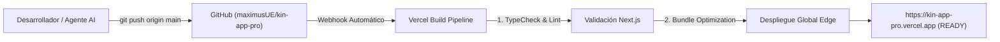

# 🚀 Operaciones, DevOps, Variables de Entorno y Despliegue (06_DEVOPS_AND_DEPLOYMENT)

> **Documento:** 06_DEVOPS_AND_DEPLOYMENT.md  
> **Infraestructura:** Vercel Global Edge Network + Google Cloud Platform  
> **Repositorio Oficial:** [`maximusUE/kin-app-pro`](https://github.com/maximusUE/kin-app-pro)  
> **Producción en Vivo:** [https://kin-app-pro.vercel.app](https://kin-app-pro.vercel.app)  

---

## 1. 🌐 Topología de Despliegue

KIN utiliza un flujo de Integración y Entrega Continua (**CI/CD**) 100% automatizado:



Cada vez que un cambio entra a la rama `main`, Vercel compila el código, ejecuta las comprobaciones de tipos y publica la nueva versión en producción sin tiempo de inactividad (*Zero-Downtime Deployment*).

---

## 2. 🔑 Matriz de Variables de Entorno (.env)

Las siguientes variables deben estar configuradas en el panel de **Vercel Project Settings ➔ Environment Variables**:

| Variable | Entorno | Propósito | Ejemplo / Formato |
| :--- | :---: | :--- | :--- |
| `FIREBASE_PROJECT_ID` | Producción / Preview | Identificador del proyecto de Google Cloud Firestore | `kin-app-prod-b97c0` |
| `FIREBASE_SERVICE_ACCOUNT_JSON` | Producción | Llave de cuenta de servicio en formato JSON serializado | `{"type":"service_account",...}` |
| `GEMINI_API_KEY` | Producción / Preview | Llave de acceso a Google Generative AI para KYC | `AIzaSy...` |
| `STRIPE_SECRET_KEY` | Producción | Llave privada de Stripe para cobro de tarjetas | `sk_live_...` / `sk_test_...` |
| `NEXT_PUBLIC_STRIPE_PUBLISHABLE_KEY` | Producción | Llave pública de Stripe para el frontend | `pk_live_...` / `pk_test_...` |
| `NEXT_TELEMETRY_DISABLED` | Todos | Desactiva telemetría no deseada en el build | `1` |

---

## 3. 💻 Guía de Instalación y Desarrollo Local

Para clonar y correr KIN en una computadora de desarrollo desde cero:

### Requisitos Previos:
- **Node.js:** Versión `18.17.0` o superior (Recomendado `Node.js 20 LTS`).
- **NPM:** `v9+` o `v10+`.
- **Git:** Instalado y configurado con acceso al repositorio.

### Paso a Paso:
```bash
# 1. Clonar el repositorio
git clone https://github.com/maximusUE/kin-app-pro.git
cd kin-app-pro

# 2. Instalar dependencias exactas
npm install

# 3. Configurar variables de entorno locales
cp .env.example .env.local
# Editar .env.local con las llaves de desarrollo

# 4. Iniciar servidor local de desarrollo
npm run dev
# La aplicación estará disponible en http://localhost:3000

# 5. Probar compilación de producción antes de subir
npm run build
```

---

## 4. 🔄 Procedimiento de Rollback Inmediato (Plan de Contingencia)

Si una versión recién desplegada presenta algún fallo imprevisto en producción, Vercel permite revertir al estado anterior en **menos de 15 segundos**:

1. **Vía Panel Web de Vercel:**
   - Ir a: `https://vercel.com/kin-ec6a/kin-app-pro/deployments`
   - Buscar el despliegue anterior que estaba funcionando correctamente (`READY`).
   - Hacer clic en los tres puntos (`...`) y seleccionar **Instant Rollback**.
2. **Vía Línea de Comandos / Git:**
   ```bash
   # Revertir el último commit localmente
   git revert HEAD
   git push origin main
   ```
   Vercel compilará y restaurará la versión estable automáticamente.

---

## 5. 🛡️ Respaldo y Continuidad del Negocio (Disaster Recovery)

- **Persistencia Firestore:** Los datos de transacciones, saldos y usuarios están respaldados con replicación multirregión en Google Cloud.
- **Auditoría de Cambios:** Todo cambio en la base de datos registra un documento en la colección `/audit_logs` con la fecha ISO, el usuario que ejecutó la acción y la dirección IP.
- **Código Fuente Inmutable:** Todo el historial del código reside protegido en GitHub con firmas criptográficas de commits.
